# Chronify System - Software Engineering Models

## Table of Contents

1. [Context Model](#context-model)
2. [Business Process Model](#business-process-model)
3. [Use Case Diagram](#use-case-diagram)
4. [Use Case Descriptions](#use-case-descriptions)
5. [Sequence Diagrams](#sequence-diagrams)
6. [Class Diagram](#class-diagram)
7. [Data Flow Diagram](#data-flow-diagram)

---

## Context Model

The Context Model defines the system boundaries and identifies how the Chronify system interacts with its external environment. Represented as a UML Deployment Diagram.

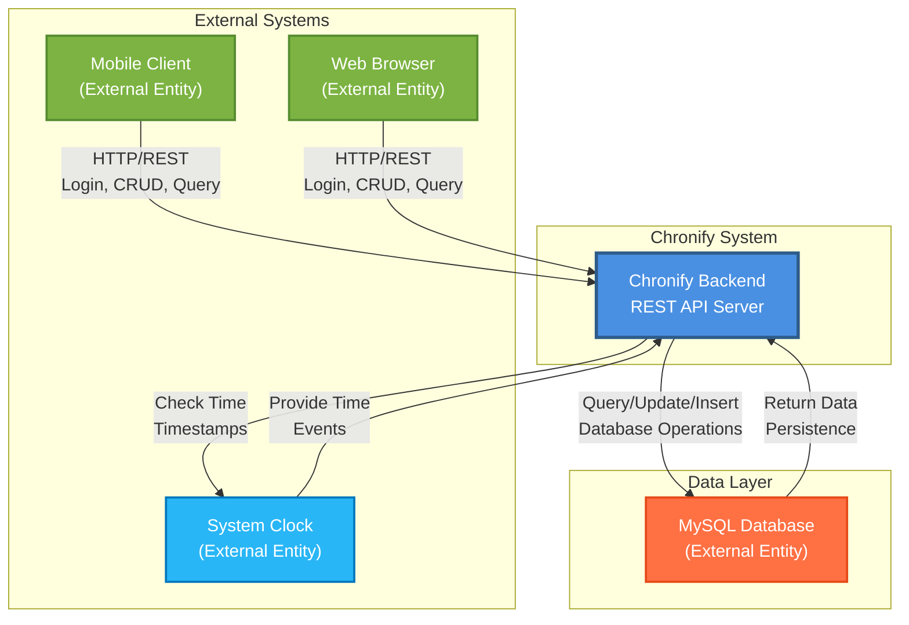

### System Boundaries

- **Inside the System**: User authentication, course management, schedule management, notes, reminders (basic CRUD only)
- **Outside the System**: Mobile/web client applications, database management system, system clock

---

## Business Process Model

The Business Process Model shows the automated business processes that Chronify will handle. Represented as a UML Activity Diagram.

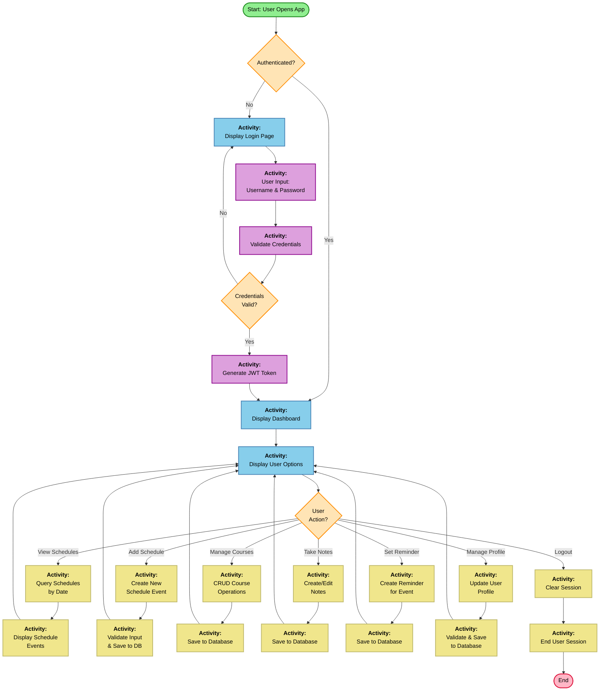

### Business Process Flow

**Main Flow**:
1. **Start**: User opens application
2. **Decision**: Check authentication status
3. **If Not Authenticated**: 
   - Display login page
   - Get user credentials (username & password)
   - Validate credentials
   - Generate JWT token on success
4. **Dashboard Display**: Show personalized user dashboard
5. **User Actions** (can repeat): User can perform one of the following:
   - View schedules by date
   - Add/Create/Edit/Delete schedules
   - Manage courses (CRUD operations)
   - Take notes (Create/Edit/Delete)
   - Set reminders for events
   - Manage user profile
6. **Save Operations**: Each action validates input and saves to database
7. **Logout**: User logs out to end session
8. **End**: Session terminated

---

## Use Case Diagram

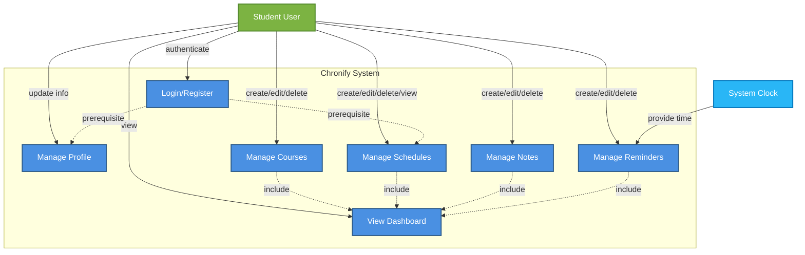

---

## Use Case Descriptions

### UC1: Login/Register

| Aspect                       | Description                                                                                                                                                                                 |
| ---------------------------- | ------------------------------------------------------------------------------------------------------------------------------------------------------------------------------------------- |
| **Actor**              | Student User                                                                                                                                                                                |
| **Precondition**       | User has a valid username/password or wants to create new account                                                                                                                           |
| **Postcondition**      | User is authenticated with JWT token and can access system                                                                                                                                  |
| **Main Flow**          | 1. User enters login page ``2. User provides username and password``3. System validates credentials against database ``4. System generates JWT token``5. System returns token and user info |
| **Alternative Flow**   | - User selects "Register"``- User provides username and password``- System checks if username exists ``- System creates new user account``- System logs user in automatically               |
| **Exception Handling** | - Invalid credentials: Return error message ``- User already exists: Return duplicate error``- Database error: Return server error                                                          |

### UC2: Manage Profile

| Aspect                       | Description                                                                                                                                                                                                                                                     |
| ---------------------------- | --------------------------------------------------------------------------------------------------------------------------------------------------------------------------------------------------------------------------------------------------------------- |
| **Actor**              | Student User (authenticated)                                                                                                                                                                                                                                    |
| **Precondition**       | User must be logged in with valid token                                                                                                                                                                                                                         |
| **Postcondition**      | User profile information is updated in system                                                                                                                                                                                                                   |
| **Main Flow**          | 1. User navigates to profile page ``2. System retrieves user info from database``3. System displays user profile form ``4. User modifies profile fields (nickname, avatar, gender, school)``5. User submits updated info``6. System validates and saves changes |
| **Alternative Flow**   | - User cancels changes: No database update``- User changes password: System re-encrypts and stores                                                                                                                                                              |
| **Exception Handling** | - Permission denied: Only own profile can be updated ``- Database error: Return error message``- Invalid input: Return validation error                                                                                                                         |

### UC3: Manage Courses

| Aspect                       | Description                                                                                                                                                                                                                                                                                           |
| ---------------------------- | ----------------------------------------------------------------------------------------------------------------------------------------------------------------------------------------------------------------------------------------------------------------------------------------------------- |
| **Actor**              | Student User (authenticated)                                                                                                                                                                                                                                                                          |
| **Precondition**       | User must be logged in                                                                                                                                                                                                                                                                                |
| **Postcondition**      | Course information is created/updated/deleted in system                                                                                                                                                                                                                                               |
| **Main Flow**          | 1. User navigates to courses section ``2. System displays list of user's courses``3. User selects "Add Course"``4. User fills course form (name, day, time, location, teacher, weeks, notes)``5. System validates input ``6. System saves course to database``7. System refreshes course list display |
| **Alternative Flow**   | - Update Course: Select existing course → modify fields → save``- Delete Course: Select course → confirm deletion → remove from database                                                                                                                                                          |
| **Exception Handling** | - Invalid time format: Show format error ``- Database conflict: Show error``- Permission denied: Cannot modify other users' courses                                                                                                                                                                   |

### UC4: Manage Schedules

| Aspect                       | Description                                                                                                                                                                                                                                                                                                                      |
| ---------------------------- | -------------------------------------------------------------------------------------------------------------------------------------------------------------------------------------------------------------------------------------------------------------------------------------------------------------------------------- |
| **Actor**              | Student User (authenticated)                                                                                                                                                                                                                                                                                                     |
| **Precondition**       | User must be logged in                                                                                                                                                                                                                                                                                                           |
| **Postcondition**      | Schedule event is created/updated/deleted in system                                                                                                                                                                                                                                                                              |
| **Main Flow**          | 1. User navigates to schedules section ``2. System displays schedule view (calendar/list)``3. User selects date or "Add Schedule"``4. User enters event details (event name, date, time, location, people, priority)``5. System validates input ``6. System saves schedule to database``7. System updates display with new event |
| **Alternative Flow**   | - Update Schedule: Select existing event → edit → save ``- Delete Schedule: Select event → confirm → remove``- View by Date: User selects date → system filters and displays                                                                                                                                                |
| **Exception Handling** | - Time conflict: Warn user of overlapping events ``- Invalid date: Show date error``- Permission denied: Cannot modify other users' schedules                                                                                                                                                                                    |

### UC5: Manage Notes

| Aspect                       | Description                                                                                                                                                                                                                                                       |
| ---------------------------- | ----------------------------------------------------------------------------------------------------------------------------------------------------------------------------------------------------------------------------------------------------------------- |
| **Actor**              | Student User (authenticated)                                                                                                                                                                                                                                      |
| **Precondition**       | User must be logged in                                                                                                                                                                                                                                            |
| **Postcondition**      | Note is created/updated/deleted in system                                                                                                                                                                                                                         |
| **Main Flow**          | 1. User navigates to notes section ``2. System displays list of user's notes``3. User selects "Create Note" or existing note ``4. User writes/edits note content``5. System auto-saves changes ``6. User submits final version``7. System stores note in database |
| **Alternative Flow**   | - Search Notes: User enters keywords → system filters notes``- Delete Note: Select note → confirm → remove                                                                                                                                                     |
| **Exception Handling** | - Database error: Show save error ``- Session expired: Require re-login``- Permission denied: Cannot modify other users' notes                                                                                                                                    |

### UC6: Manage Reminders

| Aspect                       | Description                                                                                                                                       |
| ---------------------------- | ------------------------------------------------------------------------------------------------------------------------------------------------- |
| **Actor**              | Student User (authenticated)                                                                                                                      |
| **Precondition**       | User must be logged in; Schedule event exists                                                                                                     |
| **Postcondition**      | Reminder is created/updated/deleted in database                                                                                                   |
| **Main Flow**          | 1. User views schedule event ``2. User selects "Set Reminder"``3. User chooses reminder time (before event)``4. System saves reminder to database |
| **Alternative Flow**   | - Multiple reminders: User can set multiple reminders per event``- Delete Reminder: Select reminder → confirm → remove                          |
| **Exception Handling** | - Invalid time: Reminder time cannot be after event``- Schedule not found: Cannot set reminder for non-existent event                             |

### UC7: View Dashboard

| Aspect                       | Description                                                                                                                                                                                                                                                                  |
| ---------------------------- | ---------------------------------------------------------------------------------------------------------------------------------------------------------------------------------------------------------------------------------------------------------------------------- |
| **Actor**              | Student User (authenticated)                                                                                                                                                                                                                                                 |
| **Precondition**       | User must be logged in                                                                                                                                                                                                                                                       |
| **Postcondition**      | System displays personalized dashboard view                                                                                                                                                                                                                                  |
| **Main Flow**          | 1. User logs in successfully ``2. System retrieves user's data (courses, schedules, notes)``3. System displays dashboard with:``   - Today's schedule overview``   - Upcoming courses ``   - Stored reminders``   - Recent notes``4. User can click on items to view details |
| **Alternative Flow**   | - Filter by date: User selects date range``- Sort by priority: User sorts schedules                                                                                                                                                                                          |
| **Exception Handling** | - No data available: Show empty state message``- Database error: Show error message                                                                                                                                                                                          |

---

## Sequence Diagrams

### Sequence 1: User Login Flow

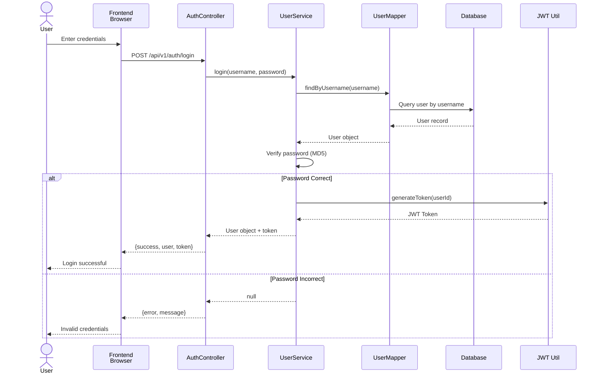

### Sequence 2: Create Schedule Event

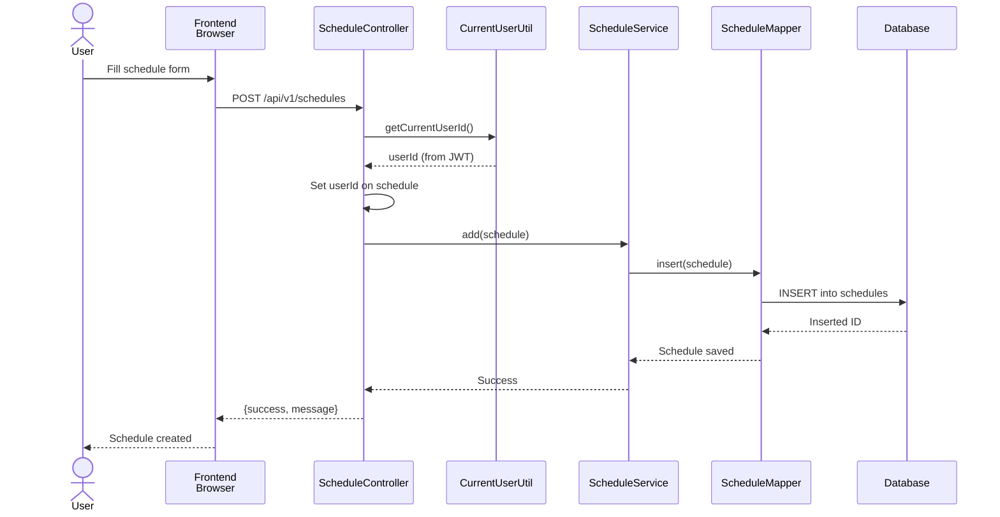

### Sequence 3: View User Profile

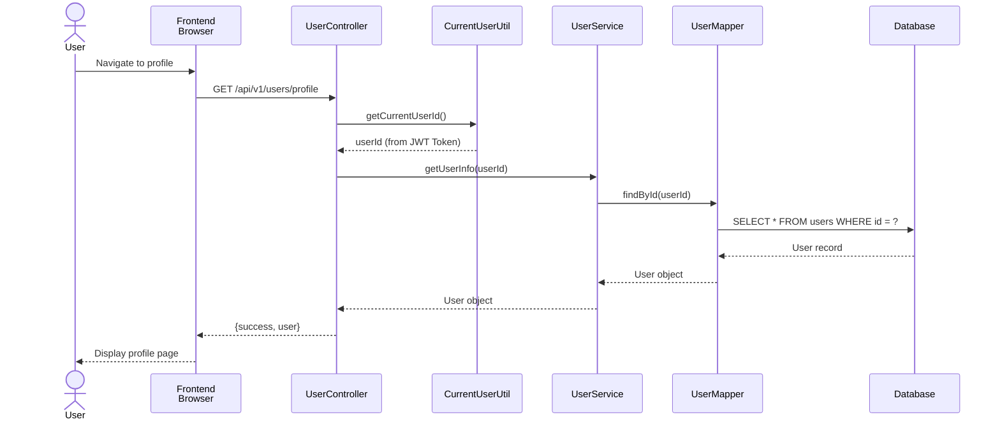

### Sequence 4: Complete Schedule Management Workflow

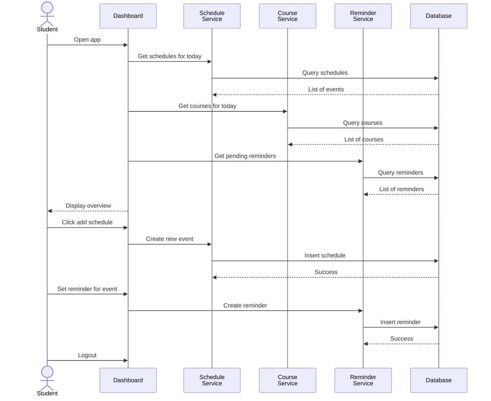

---

## Class Diagram

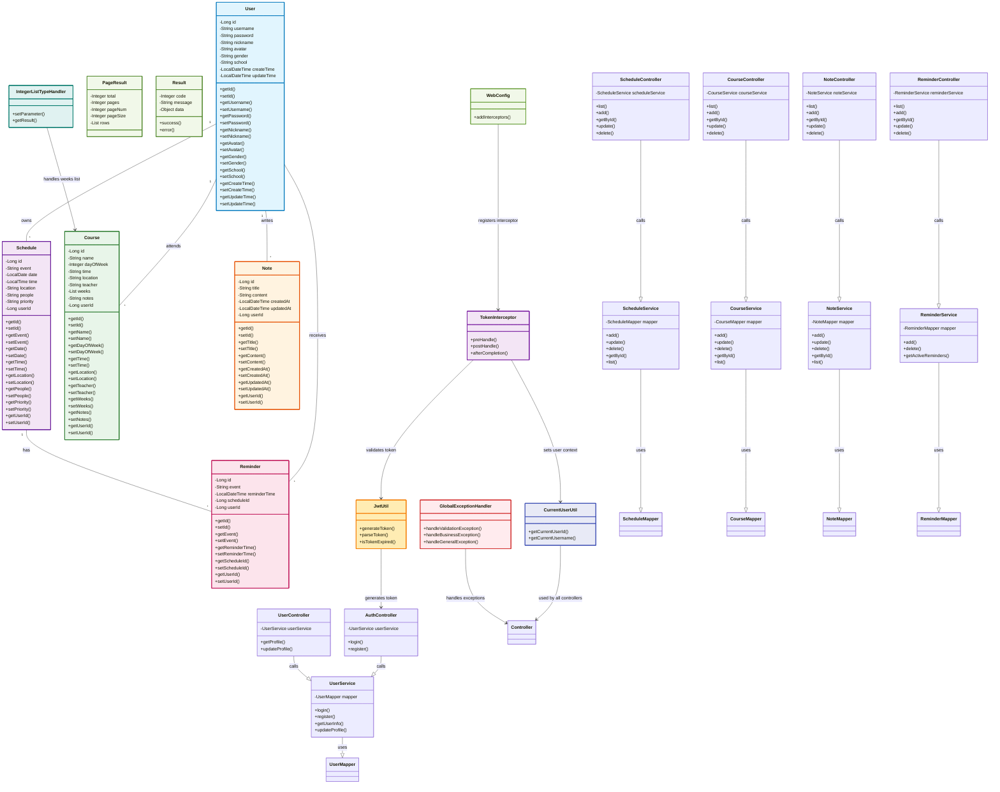

---

## Data Flow Diagram

### Level 0: System Context - UML State Diagram

The following UML State Diagram represents the system context and main data flows:

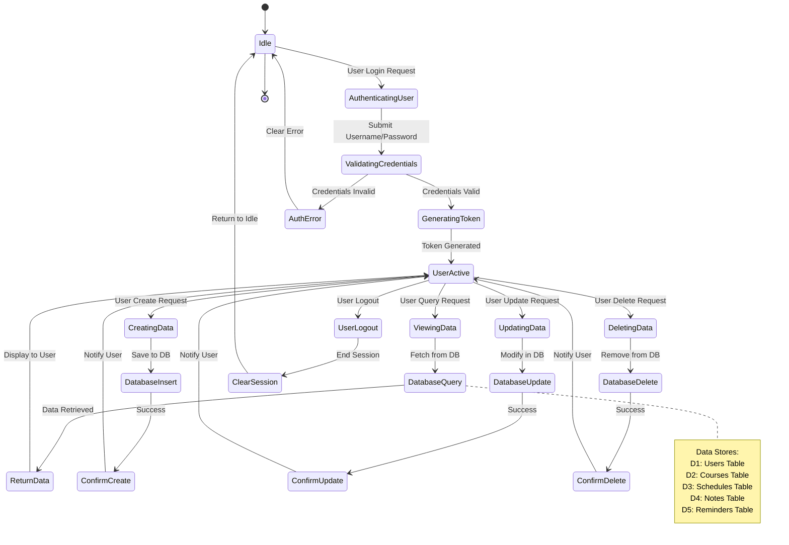

### Level 1: Process Decomposition - Data Flow Diagram

The following diagram illustrates the data flow at a decomposed level, showing how data moves between processes and data stores within the system.
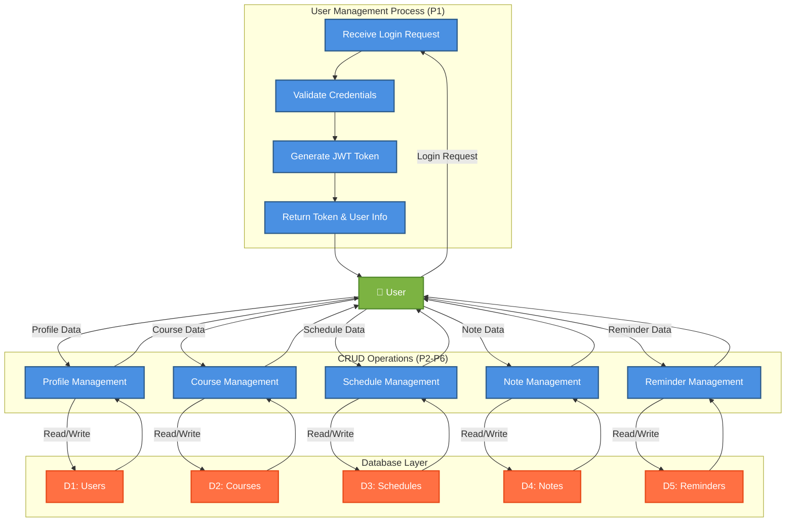

### Data Storage Definition

| Data Store ID | Name      | Description                          | Key Attributes                           |
| ------------- | --------- | ------------------------------------ | ---------------------------------------- |
| D1            | Users     | User account and profile information | id, username, password, profile_data     |
| D2            | Courses   | Course schedule information          | id, user_id, course_name, time, location |
| D3            | Schedules | Daily schedule events                | id, user_id, event, date, time, priority |
| D4            | Notes     | User notes and notes content         | id, user_id, title, content, timestamps  |
| D5            | Reminders | Reminder records                     | id, user_id, schedule_id, reminder_time  |

---

## Architecture Overview

### Layered Architecture - UML Package Diagram

```mermaid
graph TB
    subgraph "Presentation Layer"
        Web["🌐 Web Client"]
        Mobile["📱 Mobile Client"]
    end
  
    subgraph "API/Controller Layer<br/>(REST Endpoints)"
        AC["&lt;&lt;controller&gt;&gt;<br/>AuthController"]
        UC["&lt;&lt;controller&gt;&gt;<br/>UserController"]
        SC["&lt;&lt;controller&gt;&gt;<br/>ScheduleController"]
        CC["&lt;&lt;controller&gt;&gt;<br/>CourseController"]
        NC["&lt;&lt;controller&gt;&gt;<br/>NoteController"]
        RC["&lt;&lt;controller&gt;&gt;<br/>ReminderController"]
    end
  
    subgraph "Business Logic Layer<br/>(Services)"
        US["&lt;&lt;service&gt;&gt;<br/>UserService"]
        SS["&lt;&lt;service&gt;&gt;<br/>ScheduleService"]
        CS["&lt;&lt;service&gt;&gt;<br/>CourseService"]
        NS["&lt;&lt;service&gt;&gt;<br/>NoteService"]
        RS["&lt;&lt;service&gt;&gt;<br/>ReminderService"]
    end
  
    subgraph "Data Access Layer<br/>(Mappers)"
        UM["&lt;&lt;mapper&gt;&gt;<br/>UserMapper"]
        SM["&lt;&lt;mapper&gt;&gt;<br/>ScheduleMapper"]
        CM["&lt;&lt;mapper&gt;&gt;<br/>CourseMapper"]
        NM["&lt;&lt;mapper&gt;&gt;<br/>NoteMapper"]
        RM["&lt;&lt;mapper&gt;&gt;<br/>ReminderMapper"]
    end
  
    subgraph "Infrastructure Layer<br/>(Persistence & Support)"
        DB["&lt;&lt;database&gt;&gt;<br/>MySQL Database"]
        Logger["&lt;&lt;utility&gt;&gt;<br/>Logger"]
    end

    subgraph "Cross-Cutting Concerns<br/>(Security & Configuration)"
        TI["&lt;&lt;interceptor&gt;&gt;<br/>TokenInterceptor"]
        EH["&lt;&lt;handler&gt;&gt;<br/>GlobalExceptionHandler"]
        WC["&lt;&lt;config&gt;&gt;<br/>WebConfig"]
        JU["&lt;&lt;utility&gt;&gt;<br/>JwtUtil"]
        CU["&lt;&lt;utility&gt;&gt;<br/>CurrentUserUtil"]
        TH["&lt;&lt;handler&gt;&gt;<br/>IntegerListTypeHandler"]
    end

    Web -->|Request/Response| AC
    Mobile -->|Request/Response| AC
    Web -->|Request/Response| UC
    Mobile -->|Request/Response| UC

    TI -.->|intercepts| AC
    TI -.->|intercepts| UC
    TI -.->|intercepts| SC
    TI -.->|intercepts| CC
    TI -.->|intercepts| NC
    TI -.->|intercepts| RC

    AC -->|delegates| US
    UC -->|delegates| US
    SC -->|delegates| SS
    CC -->|delegates| CS
    NC -->|delegates| NS
    RC -->|delegates| RS

    US -->|queries| UM
    SS -->|queries| SM
    CS -->|queries| CM
    NS -->|queries| NM
    RS -->|queries| RM

    UM -->|CRUD| DB
    SM -->|CRUD| DB
    CM -->|CRUD| DB
    NM -->|CRUD| DB
    RM -->|CRUD| DB

    AC -.->|logs| Logger
    UC -.->|logs| Logger
    SC -.->|logs| Logger
    CC -.->|logs| Logger
    NC -.->|logs| Logger
    RC -.->|logs| Logger

    JU -->|token validation| TI
    CU -->|user context| TI
    EH -->|error handling| AC
    EH -->|error handling| UC
    EH -->|error handling| SC
    EH -->|error handling| CC
    EH -->|error handling| NC
    EH -->|error handling| RC
    WC -->|configuration| TI
    TH -->|type mapping| CM
  
    style Web fill:#7CB342,stroke:#558B2F,stroke-width:3px,color:#fff
    style Mobile fill:#7CB342,stroke:#558B2F,stroke-width:3px,color:#fff
    style AC fill:#4A90E2,stroke:#2E5C8A,stroke-width:2px,color:#fff
    style UC fill:#4A90E2,stroke:#2E5C8A,stroke-width:2px,color:#fff
    style SC fill:#4A90E2,stroke:#2E5C8A,stroke-width:2px,color:#fff
    style CC fill:#4A90E2,stroke:#2E5C8A,stroke-width:2px,color:#fff
    style NC fill:#4A90E2,stroke:#2E5C8A,stroke-width:2px,color:#fff
    style RC fill:#4A90E2,stroke:#2E5C8A,stroke-width:2px,color:#fff
    style US fill:#66BB6A,stroke:#2E7D32,stroke-width:2px,color:#fff
    style SS fill:#66BB6A,stroke:#2E7D32,stroke-width:2px,color:#fff
    style CS fill:#66BB6A,stroke:#2E7D32,stroke-width:2px,color:#fff
    style NS fill:#66BB6A,stroke:#2E7D32,stroke-width:2px,color:#fff
    style RS fill:#66BB6A,stroke:#2E7D32,stroke-width:2px,color:#fff
    style UM fill:#FFA726,stroke:#E65100,stroke-width:2px,color:#fff
    style SM fill:#FFA726,stroke:#E65100,stroke-width:2px,color:#fff
    style CM fill:#FFA726,stroke:#E65100,stroke-width:2px,color:#fff
    style NM fill:#FFA726,stroke:#E65100,stroke-width:2px,color:#fff
    style RM fill:#FFA726,stroke:#E65100,stroke-width:2px,color:#fff
    style DB fill:#FF7043,stroke:#E64A19,stroke-width:3px,color:#fff
    style TI fill:#F3E5F5,stroke:#7B1FA2,stroke-width:2px,color:#fff
    style EH fill:#FFEBEE,stroke:#D32F2F,stroke-width:2px,color:#fff
    style WC fill:#F1F8E9,stroke:#689F38,stroke-width:2px,color:#fff
    style JU fill:#FFECB3,stroke:#F57C00,stroke-width:2px,color:#fff
    style CU fill:#E8EAF6,stroke:#3F51B5,stroke-width:2px,color:#fff
    style TH fill:#E0F2F1,stroke:#00796B,stroke-width:2px,color:#fff
    style Logger fill:#CFD8DC,stroke:#37474F,stroke-width:2px,color:#fff
```

---

## Project Structure Overview

### Actual Package Organization

The Chronify backend follows a standard Spring Boot package structure under the main package `org.example`:

```
org.example/
├── ChronifyApplication.java           # Main Spring Boot application class
├── config/
│   └── WebConfig.java                 # Web MVC configuration
├── controller/
│   ├── AuthController.java            # Authentication endpoints
│   ├── CourseController.java          # Course management endpoints
│   ├── NoteController.java            # Note management endpoints
│   ├── ReminderController.java        # Reminder management endpoints
│   ├── ScheduleController.java        # Schedule management endpoints
│   └── UserController.java            # User management endpoints
├── exception/
│   └── GlobalExceptionHandler.java    # Global exception handling
├── interceptor/
│   └── TokenInterceptor.java          # JWT token validation interceptor
├── mapper/
│   ├── CourseMapper.java              # MyBatis mapper for courses
│   ├── NoteMapper.java                # MyBatis mapper for notes
│   ├── ReminderMapper.java            # MyBatis mapper for reminders
│   ├── ScheduleMapper.java            # MyBatis mapper for schedules
│   └── UserMapper.java                # MyBatis mapper for users
├── pojo/
│   ├── Course.java                    # Course entity with Lombok
│   ├── Note.java                      # Note entity with Jackson formatting
│   ├── PageResult.java                # Pagination wrapper
│   ├── Reminder.java                  # Reminder entity with Jackson formatting
│   ├── Result.java                    # API response wrapper
│   ├── Schedule.java                  # Schedule entity
│   └── User.java                      # User entity with timestamps
├── service/
│   ├── CourseService.java             # Course service interface
│   ├── NoteService.java               # Note service interface
│   ├── ReminderService.java           # Reminder service interface
│   ├── ScheduleService.java           # Schedule service interface
│   ├── UserService.java               # User service interface
│   └── impl/
│       ├── CourseServiceImpl.java     # Course service implementation
│       ├── NoteServiceImpl.java       # Note service implementation
│       ├── ReminderServiceImpl.java   # Reminder service implementation
│       ├── ScheduleServiceImpl.java   # Schedule service implementation
│       └── UserServiceImpl.java       # User service implementation
├── typehandler/
│   └── IntegerListTypeHandler.java    # MyBatis type handler for Course.weeks
└── util/
    ├── CurrentUserUtil.java           # Utility for getting current user from context
    └── JwtUtil.java                   # JWT token generation and validation
```

### Key Technologies Used

- **Spring Boot 3.x** - Main application framework
- **Spring MVC** - Web layer with RESTful APIs
- **MyBatis** - Object-relational mapping for database operations
- **MySQL** - Relational database
- **JWT (JSON Web Tokens)** - Stateless authentication
- **Lombok** - Reducing boilerplate code
- **Jackson** - JSON serialization/deserialization
- **Jakarta Servlet** - Modern servlet API

### Configuration Features

- **Token Interceptor**: Secures API endpoints with JWT validation
- **Global Exception Handler**: Centralized error handling
- **Custom Type Handler**: Handles List `<Integer>` for Course.weeks field
- **CORS Configuration**: Cross-origin resource sharing setup

---

## Summary

This document provides a comprehensive software engineering model analysis of the Chronify system, including:

1. **Context Model**: Defines system boundaries and external interactions
2. **Business Process Model**: Shows automated workflows and data transformations
3. **Use Case Diagram**: Illustrates all system use cases and actor interactions
4. **Use Case Descriptions**: Details for each use case including main flow and alternatives
5. **Sequence Diagrams**: Interaction sequences for key system operations
6. **Class Diagram**: Object-oriented design showing classes, attributes, and relationships
7. **Data Flow Diagram**: Complete data movement through the system at different abstraction levels
8. **Project Structure Overview**: Actual implementation details and package organization

These models collectively provide a complete technical specification for understanding, implementing, and maintaining the Chronify scheduling and time management application, with the project structure section reflecting the actual codebase implementation.
