# Chronify System - Software Engineering Models

## Table of Contents

1. [Context Model](#context-model)
2. [Business Process Model](#business-process-model)
3. [Use Case Diagram](#use-case-diagram)
4. [Use Case Descriptions](#use-case-descriptions)
5. [Sequence Diagrams](#sequence-diagrams)
6. [Class Diagram](#class-diagram)
7. [Data Flow Diagram](#data-flow-diagram)

---

## Context Model

The Context Model defines the system boundaries and identifies how the Chronify system interacts with its external environment.

```mermaid
graph TB
    User["👤 Mobile User<br/>Students"]
    Browser["🌐 Web Browser<br/>Frontend Client"]
    Chronify["📅 Chronify System<br/>Backend Server"]
    DB["🗄️ Database<br/>Persistence Layer"]
    Clock["⏰ System Clock<br/>For Timestamps"]

    User -->|HTTP/REST API| Chronify
    Browser -->|HTTP/REST API| Chronify
    Chronify -->|Query/Update| DB
    Chronify -->|Use Timestamps| Clock
    DB -->|Return Data| Chronify
  
    style Chronify fill:#4A90E2,stroke:#2E5C8A,stroke-width:3px,color:#fff
    style User fill:#7CB342,stroke:#558B2F,stroke-width:2px,color:#fff
    style Browser fill:#7CB342,stroke:#558B2F,stroke-width:2px,color:#fff
    style DB fill:#FF7043,stroke:#E64A19,stroke-width:2px,color:#fff
    style Clock fill:#29B6F6,stroke:#0277BD,stroke-width:2px,color:#fff
```



### System Boundaries

- **Inside the System**: User authentication, course management, schedule management, notes, reminders (basic CRUD only)
- **Outside the System**: Mobile/web client applications, database management system, system clock

---

## Business Process Model

The Business Process Model shows the automated business processes that Chronify will handle, including the workflow and data relationships.


---

## Use Case Diagram


---

## Use Case Descriptions

### UC1: Login/Register

| Aspect                       | Description                                                                                                                                                                                 |
| ---------------------------- | ------------------------------------------------------------------------------------------------------------------------------------------------------------------------------------------- |
| **Actor**              | Student User                                                                                                                                                                                |
| **Precondition**       | User has a valid username/password or wants to create new account                                                                                                                           |
| **Postcondition**      | User is authenticated with JWT token and can access system                                                                                                                                  |
| **Main Flow**          | 1. User enters login page ``2. User provides username and password``3. System validates credentials against database ``4. System generates JWT token``5. System returns token and user info |
| **Alternative Flow**   | - User selects "Register"``- User provides username and password``- System checks if username exists ``- System creates new user account``- System logs user in automatically               |
| **Exception Handling** | - Invalid credentials: Return error message ``- User already exists: Return duplicate error``- Database error: Return server error                                                          |

### UC2: Manage Profile

| Aspect                       | Description                                                                                                                                                                                                                                                     |
| ---------------------------- | --------------------------------------------------------------------------------------------------------------------------------------------------------------------------------------------------------------------------------------------------------------- |
| **Actor**              | Student User (authenticated)                                                                                                                                                                                                                                    |
| **Precondition**       | User must be logged in with valid token                                                                                                                                                                                                                         |
| **Postcondition**      | User profile information is updated in system                                                                                                                                                                                                                   |
| **Main Flow**          | 1. User navigates to profile page ``2. System retrieves user info from database``3. System displays user profile form ``4. User modifies profile fields (nickname, avatar, gender, school)``5. User submits updated info``6. System validates and saves changes |
| **Alternative Flow**   | - User cancels changes: No database update``- User changes password: System re-encrypts and stores                                                                                                                                                              |
| **Exception Handling** | - Permission denied: Only own profile can be updated ``- Database error: Return error message``- Invalid input: Return validation error                                                                                                                         |

### UC3: Manage Courses

| Aspect                       | Description                                                                                                                                                                                                                                                                                           |
| ---------------------------- | ----------------------------------------------------------------------------------------------------------------------------------------------------------------------------------------------------------------------------------------------------------------------------------------------------- |
| **Actor**              | Student User (authenticated)                                                                                                                                                                                                                                                                          |
| **Precondition**       | User must be logged in                                                                                                                                                                                                                                                                                |
| **Postcondition**      | Course information is created/updated/deleted in system                                                                                                                                                                                                                                               |
| **Main Flow**          | 1. User navigates to courses section ``2. System displays list of user's courses``3. User selects "Add Course"``4. User fills course form (name, day, time, location, teacher, weeks, notes)``5. System validates input ``6. System saves course to database``7. System refreshes course list display |
| **Alternative Flow**   | - Update Course: Select existing course → modify fields → save``- Delete Course: Select course → confirm deletion → remove from database                                                                                                                                                          |
| **Exception Handling** | - Invalid time format: Show format error ``- Database conflict: Show error``- Permission denied: Cannot modify other users' courses                                                                                                                                                                   |

### UC4: Manage Schedules

| Aspect                       | Description                                                                                                                                                                                                                                                                                                                      |
| ---------------------------- | -------------------------------------------------------------------------------------------------------------------------------------------------------------------------------------------------------------------------------------------------------------------------------------------------------------------------------- |
| **Actor**              | Student User (authenticated)                                                                                                                                                                                                                                                                                                     |
| **Precondition**       | User must be logged in                                                                                                                                                                                                                                                                                                           |
| **Postcondition**      | Schedule event is created/updated/deleted in system                                                                                                                                                                                                                                                                              |
| **Main Flow**          | 1. User navigates to schedules section ``2. System displays schedule view (calendar/list)``3. User selects date or "Add Schedule"``4. User enters event details (event name, date, time, location, people, priority)``5. System validates input ``6. System saves schedule to database``7. System updates display with new event |
| **Alternative Flow**   | - Update Schedule: Select existing event → edit → save ``- Delete Schedule: Select event → confirm → remove``- View by Date: User selects date → system filters and displays                                                                                                                                                |
| **Exception Handling** | - Time conflict: Warn user of overlapping events ``- Invalid date: Show date error``- Permission denied: Cannot modify other users' schedules                                                                                                                                                                                    |

### UC5: Manage Notes

| Aspect                       | Description                                                                                                                                                                                                                                                       |
| ---------------------------- | ----------------------------------------------------------------------------------------------------------------------------------------------------------------------------------------------------------------------------------------------------------------- |
| **Actor**              | Student User (authenticated)                                                                                                                                                                                                                                      |
| **Precondition**       | User must be logged in                                                                                                                                                                                                                                            |
| **Postcondition**      | Note is created/updated/deleted in system                                                                                                                                                                                                                         |
| **Main Flow**          | 1. User navigates to notes section ``2. System displays list of user's notes``3. User selects "Create Note" or existing note ``4. User writes/edits note content``5. System auto-saves changes ``6. User submits final version``7. System stores note in database |
| **Alternative Flow**   | - Search Notes: User enters keywords → system filters notes``- Delete Note: Select note → confirm → remove                                                                                                                                                     |
| **Exception Handling** | - Database error: Show save error ``- Session expired: Require re-login``- Permission denied: Cannot modify other users' notes                                                                                                                                    |

### UC6: Manage Reminders

| Aspect                       | Description                                                                                                                                       |
| ---------------------------- | ------------------------------------------------------------------------------------------------------------------------------------------------- |
| **Actor**              | Student User (authenticated)                                                                                                                      |
| **Precondition**       | User must be logged in; Schedule event exists                                                                                                     |
| **Postcondition**      | Reminder is created/updated/deleted in database                                                                                                   |
| **Main Flow**          | 1. User views schedule event ``2. User selects "Set Reminder"``3. User chooses reminder time (before event)``4. System saves reminder to database |
| **Alternative Flow**   | - Multiple reminders: User can set multiple reminders per event``- Delete Reminder: Select reminder → confirm → remove                          |
| **Exception Handling** | - Invalid time: Reminder time cannot be after event``- Schedule not found: Cannot set reminder for non-existent event                             |

### UC7: View Dashboard

| Aspect                       | Description                                                                                                                                                                                                                                                                  |
| ---------------------------- | ---------------------------------------------------------------------------------------------------------------------------------------------------------------------------------------------------------------------------------------------------------------------------- |
| **Actor**              | Student User (authenticated)                                                                                                                                                                                                                                                 |
| **Precondition**       | User must be logged in                                                                                                                                                                                                                                                       |
| **Postcondition**      | System displays personalized dashboard view                                                                                                                                                                                                                                  |
| **Main Flow**          | 1. User logs in successfully ``2. System retrieves user's data (courses, schedules, notes)``3. System displays dashboard with:``   - Today's schedule overview``   - Upcoming courses ``   - Stored reminders``   - Recent notes``4. User can click on items to view details |
| **Alternative Flow**   | - Filter by date: User selects date range``- Sort by priority: User sorts schedules                                                                                                                                                                                          |
| **Exception Handling** | - No data available: Show empty state message``- Database error: Show error message                                                                                                                                                                                          |

---

## Sequence Diagrams

### Sequence 1: User Login Flow


### Sequence 2: Create Schedule Event


### Sequence 3: View User Profile


### Sequence 4: Complete Schedule Management Workflow


---

## Class Diagram


---

## Data Flow Diagram

### Level 0: System Context

```mermaid
graph LR
    User["👤 User/Student<br/>(External Entity)"]
    System["📅 Chronify System<br/>(Process)"]
    DB["🗄️ Database<br/>(Data Store)"]

    User -->|Request:<br/>Login, Schedules,<br/>Courses, Notes| System
    System -->|Response:<br/>User Info, Events,<br/>Confirmation| User
    System -->|Store/Retrieve<br/>Data| DB
    DB -->|Persistent<br/>Data| System
  
    style User fill:#7CB342,stroke:#558B2F,stroke-width:2px,color:#fff
    style System fill:#4A90E2,stroke:#2E5C8A,stroke-width:2px,color:#fff
    style DB fill:#FF7043,stroke:#E64A19,stroke-width:2px,color:#fff
```



### Level 1: Main Processes

```mermaid
graph TB
    User["👤 User"]
  
    subgraph "Chronify System"
        P1["1.0<br/>User Authentication<br/>& Authorization"]
        P2["2.0<br/>Profile Management"]
        P3["3.0<br/>Course Management"]
        P4["4.0<br/>Schedule Management"]
        P5["5.0<br/>Note Management"]
        P6["6.0<br/>Reminder Management"]
    end

    DB["🗄️ Database<br/>D1: Users<br/>D2: Courses<br/>D3: Schedules<br/>D4: Notes<br/>D5: Reminders"]
  
    User -->|Credentials| P1
    P1 -->|Session Token| User
    P1 -->|Validate User| DB
  
    User -->|Profile Data| P2
    P2 -->|Profile Info| User
    P2 -->|Read/Write| DB
  
    User -->|Course Info| P3
    P3 -->|Course List| User
    P3 -->|CRUD| DB
  
    User -->|Schedule Events| P4
    P4 -->|Schedule Data| User
    P4 -->|CRUD| DB
  
    User -->|Note Content| P5
    P5 -->|Notes| User
    P5 -->|CRUD| DB
  
    User -->|Reminder Request| P6
    P6 -->|Reminder Status| User
    P6 -->|CRUD| DB
  
    style P1 fill:#4A90E2,stroke:#2E5C8A,stroke-width:2px,color:#fff
    style P2 fill:#4A90E2,stroke:#2E5C8A,stroke-width:2px,color:#fff
    style P3 fill:#4A90E2,stroke:#2E5C8A,stroke-width:2px,color:#fff
    style P4 fill:#4A90E2,stroke:#2E5C8A,stroke-width:2px,color:#fff
    style P5 fill:#4A90E2,stroke:#2E5C8A,stroke-width:2px,color:#fff
    style P6 fill:#4A90E2,stroke:#2E5C8A,stroke-width:2px,color:#fff
    style User fill:#7CB342,stroke:#558B2F,stroke-width:2px,color:#fff
    style DB fill:#AB47BC,stroke:#6A1B9A,stroke-width:2px,color:#fff
```



### Level 1: Detailed Process - Schedule Management (P4)

```mermaid
graph LR
    User["👤 User"]
  
    subgraph "Schedule Management Process"
        P4A["4.1<br/>Receive Schedule<br/>Request"]
        P4B["4.2<br/>Validate<br/>Input Data"]
        P4C["4.3<br/>Process<br/>Schedule"]
        P4D["4.4<br/>Generate<br/>Response"]
    end
  
    DB["🗄️ Database<br/>D3: Schedules"]

    User -->|Schedule Data| P4A
    P4A -->|Request Data| P4B
    P4B -->|Valid Data| P4C
    P4B -->|Invalid Data| P4D
    P4C -->|CRUD Operations| DB
    DB -->|Stored Data| P4C
    P4C -->|Process Result| P4D
    P4D -->|Response| User
  
    style P4A fill:#4A90E2,stroke:#2E5C8A,stroke-width:2px,color:#fff
    style P4B fill:#4A90E2,stroke:#2E5C8A,stroke-width:2px,color:#fff
    style P4C fill:#4A90E2,stroke:#2E5C8A,stroke-width:2px,color:#fff
    style P4D fill:#4A90E2,stroke:#2E5C8A,stroke-width:2px,color:#fff
    style User fill:#7CB342,stroke:#558B2F,stroke-width:2px,color:#fff
    style DB fill:#AB47BC,stroke:#6A1B9A,stroke-width:2px,color:#fff
```



### Data Storage Definition

| Data Store ID | Name      | Description                          | Key Attributes                           |
| ------------- | --------- | ------------------------------------ | ---------------------------------------- |
| D1            | Users     | User account and profile information | id, username, password, profile_data     |
| D2            | Courses   | Course schedule information          | id, user_id, course_name, time, location |
| D3            | Schedules | Daily schedule events                | id, user_id, event, date, time, priority |
| D4            | Notes     | User notes and notes content         | id, user_id, title, content, timestamps  |
| D5            | Reminders | Reminder records                     | id, user_id, schedule_id, reminder_time  |

---

## Architecture Overview

### Layered Architecture

```mermaid
graph TB
    subgraph "Presentation Layer"
        Web["🌐 Web Client"]
        Mobile["📱 Mobile Client"]
    end
  
    subgraph "API Layer"
        AC["AuthController"]
        UC["UserController"]
        SC["ScheduleController"]
        CC["CourseController"]
        NC["NoteController"]
        RC["ReminderController"]
    end
  
    subgraph "Business Logic Layer"
        US["UserService"]
        SS["ScheduleService"]
        CS["CourseService"]
        NS["NoteService"]
        RS["ReminderService"]
    end
  
    subgraph "Data Access Layer"
        UM["UserMapper"]
        SM["ScheduleMapper"]
        CM["CourseMapper"]
        NM["NoteMapper"]
        RM["ReminderMapper"]
    end
  
    subgraph "Infrastructure Layer"
        DB["🗄️ MySQL Database"]
        Cache["💾 Cache"]
        Logger["📝 Logger"]
    end

    subgraph "Security & Configuration"
        TI["TokenInterceptor"]
        EH["GlobalExceptionHandler"]
        WC["WebConfig"]
        JU["JwtUtil"]
        CU["CurrentUserUtil"]
        TH["IntegerListTypeHandler"]
    end

    Web --> AC
    Mobile --> AC
    Web --> UC
    Mobile --> UC

    TI --> AC
    TI --> UC
    TI --> SC
    TI --> CC
    TI --> NC
    TI --> RC

    AC -.->|HTTP| AC
    UC --> US
    SC --> SS
    CC --> CS
    NC --> NS
    RC --> RS

    US --> UM
    SS --> SM
    CS --> CM
    NS --> NM
    RS --> RM

    UM --> DB
    SM --> DB
    CM --> DB
    NM --> DB
    RM --> DB

    AC -.->|logs| Logger
    US -.->|logs| Logger
    SS -.->|logs| Logger

    US -.->|cache| Cache
    SS -.->|cache| Cache
    CS -.->|cache| Cache

    JU --> TI
    CU --> TI
    EH --> AC
    EH --> UC
    EH --> SC
    EH --> CC
    EH --> NC
    EH --> RC
    WC --> TI
    TH --> CM
  
    style Web fill:#7CB342,stroke:#558B2F,stroke-width:2px,color:#fff
    style Mobile fill:#7CB342,stroke:#558B2F,stroke-width:2px,color:#fff
    style AC fill:#4A90E2,stroke:#2E5C8A,stroke-width:2px,color:#fff
    style UC fill:#4A90E2,stroke:#2E5C8A,stroke-width:2px,color:#fff
    style SC fill:#4A90E2,stroke:#2E5C8A,stroke-width:2px,color:#fff
    style CC fill:#4A90E2,stroke:#2E5C8A,stroke-width:2px,color:#fff
    style NC fill:#4A90E2,stroke:#2E5C8A,stroke-width:2px,color:#fff
    style RC fill:#4A90E2,stroke:#2E5C8A,stroke-width:2px,color:#fff
    style DB fill:#FF7043,stroke:#E64A19,stroke-width:2px,color:#fff
    style TI fill:#F3E5F5,stroke:#7B1FA2,stroke-width:2px,color:#fff
    style EH fill:#FFEBEE,stroke:#D32F2F,stroke-width:2px,color:#fff
    style WC fill:#F1F8E9,stroke:#689F38,stroke-width:2px,color:#fff
    style JU fill:#FFECB3,stroke:#F57C00,stroke-width:2px,color:#fff
    style CU fill:#E8EAF6,stroke:#3F51B5,stroke-width:2px,color:#fff
    style TH fill:#E0F2F1,stroke:#00796B,stroke-width:2px,color:#fff
```



---

## Project Structure Overview

### Actual Package Organization

The Chronify backend follows a standard Spring Boot package structure under the main package `org.example`:

```
org.example/
├── ChronifyApplication.java           # Main Spring Boot application class
├── config/
│   └── WebConfig.java                 # Web MVC configuration
├── controller/
│   ├── AuthController.java            # Authentication endpoints
│   ├── CourseController.java          # Course management endpoints
│   ├── NoteController.java            # Note management endpoints
│   ├── ReminderController.java        # Reminder management endpoints
│   ├── ScheduleController.java        # Schedule management endpoints
│   └── UserController.java            # User management endpoints
├── exception/
│   └── GlobalExceptionHandler.java    # Global exception handling
├── interceptor/
│   └── TokenInterceptor.java          # JWT token validation interceptor
├── mapper/
│   ├── CourseMapper.java              # MyBatis mapper for courses
│   ├── NoteMapper.java                # MyBatis mapper for notes
│   ├── ReminderMapper.java            # MyBatis mapper for reminders
│   ├── ScheduleMapper.java            # MyBatis mapper for schedules
│   └── UserMapper.java                # MyBatis mapper for users
├── pojo/
│   ├── Course.java                    # Course entity with Lombok
│   ├── Note.java                      # Note entity with Jackson formatting
│   ├── PageResult.java                # Pagination wrapper
│   ├── Reminder.java                  # Reminder entity with Jackson formatting
│   ├── Result.java                    # API response wrapper
│   ├── Schedule.java                  # Schedule entity
│   └── User.java                      # User entity with timestamps
├── service/
│   ├── CourseService.java             # Course service interface
│   ├── NoteService.java               # Note service interface
│   ├── ReminderService.java           # Reminder service interface
│   ├── ScheduleService.java           # Schedule service interface
│   ├── UserService.java               # User service interface
│   └── impl/
│       ├── CourseServiceImpl.java     # Course service implementation
│       ├── NoteServiceImpl.java       # Note service implementation
│       ├── ReminderServiceImpl.java   # Reminder service implementation
│       ├── ScheduleServiceImpl.java   # Schedule service implementation
│       └── UserServiceImpl.java       # User service implementation
├── typehandler/
│   └── IntegerListTypeHandler.java    # MyBatis type handler for Course.weeks
└── util/
    ├── CurrentUserUtil.java           # Utility for getting current user from context
    └── JwtUtil.java                   # JWT token generation and validation
```

### Key Technologies Used

- **Spring Boot 3.x** - Main application framework
- **Spring MVC** - Web layer with RESTful APIs
- **MyBatis** - Object-relational mapping for database operations
- **MySQL** - Relational database
- **JWT (JSON Web Tokens)** - Stateless authentication
- **Lombok** - Reducing boilerplate code
- **Jackson** - JSON serialization/deserialization
- **Jakarta Servlet** - Modern servlet API

### Configuration Features

- **Token Interceptor**: Secures API endpoints with JWT validation
- **Global Exception Handler**: Centralized error handling
- **Custom Type Handler**: Handles List `<Integer>` for Course.weeks field
- **CORS Configuration**: Cross-origin resource sharing setup

---

## Summary

This document provides a comprehensive software engineering model analysis of the Chronify system, including:

1. **Context Model**: Defines system boundaries and external interactions
2. **Business Process Model**: Shows automated workflows and data transformations
3. **Use Case Diagram**: Illustrates all system use cases and actor interactions
4. **Use Case Descriptions**: Details for each use case including main flow and alternatives
5. **Sequence Diagrams**: Interaction sequences for key system operations
6. **Class Diagram**: Object-oriented design showing classes, attributes, and relationships
7. **Data Flow Diagram**: Complete data movement through the system at different abstraction levels
8. **Project Structure Overview**: Actual implementation details and package organization

These models collectively provide a complete technical specification for understanding, implementing, and maintaining the Chronify scheduling and time management application, with the project structure section reflecting the actual codebase implementation.
