# Chronify System - Software Engineering Models

## Table of Contents
1. [Context Model](#context-model)
2. [Business Process Model](#business-process-model)
3. [Use Case Diagram](#use-case-diagram)
4. [Use Case Descriptions](#use-case-descriptions)
5. [Sequence Diagrams](#sequence-diagrams)
6. [Class Diagram](#class-diagram)
7. [Data Flow Diagram](#data-flow-diagram)

---

## Context Model

The Context Model defines the system boundaries and identifies how the Chronify system interacts with its external environment.

```mermaid
graph TB
    User["👤 Mobile User<br/>Students"]
    Browser["🌐 Web Browser<br/>Frontend Client"]
    Chronify["📅 Chronify System<br/>Backend Server"]
    DB["🗄️ Database<br/>Persistence Layer"]
    Email["📧 Email Service<br/>External Service"]
    Clock["⏰ System Clock<br/>Event Trigger"]
    
    User -->|HTTP/REST API| Chronify
    Browser -->|HTTP/REST API| Chronify
    Chronify -->|Query/Update| DB
    Chronify -->|Send Reminders| Email
    Chronify -->|Check Time| Clock
    DB -->|Return Data| Chronify
    Email -->|Confirmation| User
    
    style Chronify fill:#4A90E2,stroke:#2E5C8A,stroke-width:3px,color:#fff
    style User fill:#7CB342,stroke:#558B2F,stroke-width:2px,color:#fff
    style Browser fill:#7CB342,stroke:#558B2F,stroke-width:2px,color:#fff
    style DB fill:#FF7043,stroke:#E64A19,stroke-width:2px,color:#fff
    style Email fill:#AB47BC,stroke:#6A1B9A,stroke-width:2px,color:#fff
    style Clock fill:#29B6F6,stroke:#0277BD,stroke-width:2px,color:#fff
```

### System Boundaries
- **Inside the System**: User authentication, course management, schedule management, notes, reminders
- **Outside the System**: Mobile/web client applications, database management system, email service, system clock

---

## Business Process Model

The Business Process Model shows the automated business processes that Chronify will handle, including the workflow and data relationships.

---

## Use Case Diagram

---

## Use Case Descriptions

### UC1: Login/Register

| Aspect | Description |
|--------|-------------|
| **Actor** | Student User |
| **Precondition** | User has a valid username/password or wants to create new account |
| **Postcondition** | User is authenticated with JWT token and can access system |
| **Main Flow** | 1. User enters login page 2. User provides username and password 3. System validates credentials against database 4. System generates JWT token 5. System returns token and user info |
| **Alternative Flow** | - User selects "Register" - User provides username and password - System checks if username exists - System creates new user account - System logs user in automatically |
| **Exception Handling** | - Invalid credentials: Return error message - User already exists: Return duplicate error - Database error: Return server error |

### UC2: Manage Profile

| Aspect | Description |
|--------|-------------|
| **Actor** | Student User (authenticated) |
| **Precondition** | User must be logged in with valid token |
| **Postcondition** | User profile information is updated in system |
| **Main Flow** | 1. User navigates to profile page 2. System retrieves user info from database 3. System displays user profile form 4. User modifies profile fields (nickname, avatar, gender, school) 5. User submits updated info 6. System validates and saves changes |
| **Alternative Flow** | - User cancels changes: No database update - User changes password: System re-encrypts and stores |
| **Exception Handling** | - Permission denied: Only own profile can be updated - Database error: Return error message - Invalid input: Return validation error |

### UC3: Manage Courses

| Aspect | Description |
|--------|-------------|
| **Actor** | Student User (authenticated) |
| **Precondition** | User must be logged in |
| **Postcondition** | Course information is created/updated/deleted in system |
| **Main Flow** | 1. User navigates to courses section 2. System displays list of user's courses 3. User selects "Add Course" 4. User fills course form (name, day, time, location, teacher, weeks, notes) 5. System validates input 6. System saves course to database 7. System refreshes course list display |
| **Alternative Flow** | - Update Course: Select existing course → modify fields → save - Delete Course: Select course → confirm deletion → remove from database |
| **Exception Handling** | - Invalid time format: Show format error - Database conflict: Show error - Permission denied: Cannot modify other users' courses |

### UC4: Manage Schedules

| Aspect | Description |
|--------|-------------|
| **Actor** | Student User (authenticated) |
| **Precondition** | User must be logged in |
| **Postcondition** | Schedule event is created/updated/deleted in system |
| **Main Flow** | 1. User navigates to schedules section 2. System displays schedule view (calendar/list) 3. User selects date or "Add Schedule" 4. User enters event details (event name, date, time, location, people, priority) 5. System validates input 6. System saves schedule to database 7. System updates display with new event |
| **Alternative Flow** | - Update Schedule: Select existing event → edit → save - Delete Schedule: Select event → confirm → remove - View by Date: User selects date → system filters and displays |
| **Exception Handling** | - Time conflict: Warn user of overlapping events - Invalid date: Show date error - Permission denied: Cannot modify other users' schedules |

### UC5: Manage Notes

| Aspect | Description |
|--------|-------------|
| **Actor** | Student User (authenticated) |
| **Precondition** | User must be logged in |
| **Postcondition** | Note is created/updated/deleted in system |
| **Main Flow** | 1. User navigates to notes section 2. System displays list of user's notes 3. User selects "Create Note" or existing note 4. User writes/edits note content 5. System auto-saves changes 6. User submits final version 7. System stores note in database |
| **Alternative Flow** | - Search Notes: User enters keywords → system filters notes - Delete Note: Select note → confirm → remove |
| **Exception Handling** | - Database error: Show save error - Session expired: Require re-login - Permission denied: Cannot modify other users' notes |

### UC6: Manage Reminders

| Aspect | Description |
|--------|-------------|
| **Actor** | Student User (authenticated) |
| **Precondition** | User must be logged in; Schedule event exists |
| **Postcondition** | Reminder is created/updated/deleted; System will notify user |
| **Main Flow** | 1. User views schedule event 2. User selects "Set Reminder" 3. User chooses reminder time (before event) 4. System saves reminder to database 5. System monitors time 6. At reminder time, system triggers notification |
| **Alternative Flow** | - Multiple reminders: User can set multiple reminders per event - Delete Reminder: Select reminder → confirm → remove |
| **Exception Handling** | - Invalid time: Reminder time cannot be after event - Schedule not found: Cannot set reminder for non-existent event |

### UC7: View Dashboard

| Aspect | Description |
|--------|-------------|
| **Actor** | Student User (authenticated) |
| **Precondition** | User must be logged in |
| **Postcondition** | System displays personalized dashboard view |
| **Main Flow** | 1. User logs in successfully 2. System retrieves user's data (courses, schedules, notes) 3. System displays dashboard with:    - Today's schedule overview    - Upcoming courses    - Pending reminders    - Recent notes 4. User can click on items to view details |
| **Alternative Flow** | - Filter by date: User selects date range - Sort by priority: User sorts schedules |
| **Exception Handling** | - No data available: Show empty state message - Database error: Show error message |

### UC8: System Notification

| Aspect | Description |
|--------|-------------|
| **Actor** | System (triggered by reminder/schedule) |
| **Precondition** | Reminder time has been reached; User is online |
| **Postcondition** | User receives notification; Email sent if configured |
| **Main Flow** | 1. System clock reaches reminder time 2. System queries active reminders 3. System checks if reminder is due 4. System sends in-app notification to user 5. System optionally sends email notification 6. System logs notification event |
| **Alternative Flow** | - Offline notification: Store notification; deliver when user comes online |
| **Exception Handling** | - Email service unavailable: Log error; try retry mechanism - User deleted event: Skip notification |

---

## Sequence Diagrams

### Sequence 1: User Login Flow

### Sequence 2: Create Schedule Event

### Sequence 3: Trigger Reminder Notification

### Sequence 4: View User Profile

### Sequence 5: Complete Schedule Management Workflow

---

## Class Diagram

---

## Data Flow Diagram

### Level 0: System Context

```mermaid
graph LR
    User["👤 User/Student<br/>(External Entity)"]
    System["📅 Chronify System<br/>(Process)"]
    DB["🗄️ Database<br/>(Data Store)"]
    Email["📧 Email Service<br/>(External Entity)"]
    
    User -->|Request:<br/>Login, Schedules,<br/>Courses, Notes| System
    System -->|Response:<br/>User Info, Events,<br/>Confirmation| User
    System -->|Store/Retrieve<br/>Data| DB
    DB -->|Persistent<br/>Data| System
    System -->|Notification<br/>Email| Email
    Email -->|Delivery<br/>Confirmation| System
    
    style User fill:#7CB342,stroke:#558B2F,stroke-width:2px,color:#fff
    style System fill:#4A90E2,stroke:#2E5C8A,stroke-width:2px,color:#fff
    style DB fill:#FF7043,stroke:#E64A19,stroke-width:2px,color:#fff
    style Email fill:#AB47BC,stroke:#6A1B9A,stroke-width:2px,color:#fff
```

### Level 1: Main Processes

```mermaid
graph TB
    User["👤 User"]
    
    subgraph "Chronify System"
        P1["1.0<br/>User Authentication<br/>& Authorization"]
        P2["2.0<br/>Profile Management"]
        P3["3.0<br/>Course Management"]
        P4["4.0<br/>Schedule Management"]
        P5["5.0<br/>Note Management"]
        P6["6.0<br/>Reminder Management"]
        P7["7.0<br/>Notification Engine"]
    end
    
    DB["🗄️ Database<br/>D1: Users<br/>D2: Courses<br/>D3: Schedules<br/>D4: Notes<br/>D5: Reminders"]
    Email["📧 Email Service"]
    Clock["⏰ System Clock"]
    
    User -->|Credentials| P1
    P1 -->|Session Token| User
    P1 -->|Validate User| DB
    
    User -->|Profile Data| P2
    P2 -->|Profile Info| User
    P2 -->|Read/Write| DB
    
    User -->|Course Info| P3
    P3 -->|Course List| User
    P3 -->|CRUD| DB
    
    User -->|Schedule Events| P4
    P4 -->|Schedule Data| User
    P4 -->|CRUD| DB
    
    User -->|Note Content| P5
    P5 -->|Notes| User
    P5 -->|CRUD| DB
    
    User -->|Reminder Request| P6
    P6 -->|Reminder Status| User
    P6 -->|CRUD| DB
    
    Clock -->|Time Check| P7
    P7 -->|Query| DB
    DB -->|Due Reminders| P7
    P7 -->|Notification| User
    P7 -->|Send Email| Email
    
    style P1 fill:#4A90E2,stroke:#2E5C8A,stroke-width:2px,color:#fff
    style P2 fill:#4A90E2,stroke:#2E5C8A,stroke-width:2px,color:#fff
    style P3 fill:#4A90E2,stroke:#2E5C8A,stroke-width:2px,color:#fff
    style P4 fill:#4A90E2,stroke:#2E5C8A,stroke-width:2px,color:#fff
    style P5 fill:#4A90E2,stroke:#2E5C8A,stroke-width:2px,color:#fff
    style P6 fill:#4A90E2,stroke:#2E5C8A,stroke-width:2px,color:#fff
    style P7 fill:#FF7043,stroke:#E64A19,stroke-width:2px,color:#fff
    style User fill:#7CB342,stroke:#558B2F,stroke-width:2px,color:#fff
    style DB fill:#AB47BC,stroke:#6A1B9A,stroke-width:2px,color:#fff
    style Email fill:#FFB300,stroke:#FF8F00,stroke-width:2px,color:#fff
    style Clock fill:#29B6F6,stroke:#0277BD,stroke-width:2px,color:#fff
```

### Level 1: Detailed Process - Schedule Management (P4)

```mermaid
graph LR
    User["👤 User"]
    
    subgraph "Schedule Management Process"
        P4A["4.1<br/>Receive Schedule<br/>Request"]
        P4B["4.2<br/>Validate<br/>Input Data"]
        P4C["4.3<br/>Process<br/>Schedule"]
        P4D["4.4<br/>Generate<br/>Response"]
    end
    
    DB["🗄️ Database<br/>D3: Schedules"]
    Reminder["🔔 Reminder<br/>System"]
    
    User -->|Schedule Data| P4A
    P4A -->|Request Data| P4B
    P4B -->|Valid Data| P4C
    P4B -->|Invalid Data| P4D
    P4C -->|CRUD Operations| DB
    DB -->|Stored Data| P4C
    P4C -->|Event Trigger| Reminder
    P4C -->|Process Result| P4D
    P4D -->|Response| User
    
    style P4A fill:#4A90E2,stroke:#2E5C8A,stroke-width:2px,color:#fff
    style P4B fill:#4A90E2,stroke:#2E5C8A,stroke-width:2px,color:#fff
    style P4C fill:#4A90E2,stroke:#2E5C8A,stroke-width:2px,color:#fff
    style P4D fill:#4A90E2,stroke:#2E5C8A,stroke-width:2px,color:#fff
    style User fill:#7CB342,stroke:#558B2F,stroke-width:2px,color:#fff
    style DB fill:#AB47BC,stroke:#6A1B9A,stroke-width:2px,color:#fff
    style Reminder fill:#FF7043,stroke:#E64A19,stroke-width:2px,color:#fff
```

### Data Storage Definition

| Data Store ID | Name | Description | Key Attributes |
|---|---|---|---|
| D1 | Users | User account and profile information | id, username, password, profile_data |
| D2 | Courses | Course schedule information | id, user_id, course_name, time, location |
| D3 | Schedules | Daily schedule events | id, user_id, event, date, time, priority |
| D4 | Notes | User notes and notes content | id, user_id, title, content, timestamps |
| D5 | Reminders | Reminder records | id, user_id, schedule_id, reminder_time |

---

## Architecture Overview

### Layered Architecture

```mermaid
graph TB
    subgraph "Presentation Layer"
        Web["🌐 Web Client"]
        Mobile["📱 Mobile Client"]
    end
    
    subgraph "API Layer"
        AC["AuthController"]
        UC["UserController"]
        SC["ScheduleController"]
        CC["CourseController"]
        NC["NoteController"]
        RC["ReminderController"]
    end
    
    subgraph "Business Logic Layer"
        US["UserService"]
        SS["ScheduleService"]
        CS["CourseService"]
        NS["NoteService"]
        RS["ReminderService"]
    end
    
    subgraph "Data Access Layer"
        UM["UserMapper"]
        SM["ScheduleMapper"]
        CM["CourseMapper"]
        NM["NoteMapper"]
        RM["ReminderMapper"]
    end
    
    subgraph "Infrastructure Layer"
        DB["🗄️ MySQL Database"]
        Cache["💾 Cache"]
        Logger["📝 Logger"]
    end
    
    Web --> AC
    Mobile --> AC
    Web --> UC
    Mobile --> UC
    
    AC -.->|HTTP| AC
    UC --> US
    SC --> SS
    CC --> CS
    NC --> NS
    RC --> RS
    
    US --> UM
    SS --> SM
    CS --> CM
    NS --> NM
    RS --> RM
    
    UM --> DB
    SM --> DB
    CM --> DB
    NM --> DB
    RM --> DB
    
    AC -.->|logs| Logger
    US -.->|logs| Logger
    SS -.->|logs| Logger
    
    US -.->|cache| Cache
    SS -.->|cache| Cache
    CS -.->|cache| Cache
    
    style Web fill:#7CB342,stroke:#558B2F,stroke-width:2px,color:#fff
    style Mobile fill:#7CB342,stroke:#558B2F,stroke-width:2px,color:#fff
    style AC fill:#4A90E2,stroke:#2E5C8A,stroke-width:2px,color:#fff
    style UC fill:#4A90E2,stroke:#2E5C8A,stroke-width:2px,color:#fff
    style SC fill:#4A90E2,stroke:#2E5C8A,stroke-width:2px,color:#fff
    style CC fill:#4A90E2,stroke:#2E5C8A,stroke-width:2px,color:#fff
    style NC fill:#4A90E2,stroke:#2E5C8A,stroke-width:2px,color:#fff
    style RC fill:#4A90E2,stroke:#2E5C8A,stroke-width:2px,color:#fff
    style DB fill:#FF7043,stroke:#E64A19,stroke-width:2px,color:#fff
```

---

## Summary

This document provides a comprehensive software engineering model analysis of the Chronify system, including:

1. **Context Model**: Defines system boundaries and external interactions
2. **Business Process Model**: Shows automated workflows and data transformations
3. **Use Case Diagram**: Illustrates all system use cases and actor interactions
4. **Use Case Descriptions**: Details for each use case including main flow and alternatives
5. **Sequence Diagrams**: Interaction sequences for key system operations
6. **Class Diagram**: Object-oriented design showing classes, attributes, and relationships
7. **Data Flow Diagram**: Complete data movement through the system at different abstraction levels

These models collectively provide a complete technical specification for understanding, implementing, and maintaining the Chronify scheduling and time management application.
